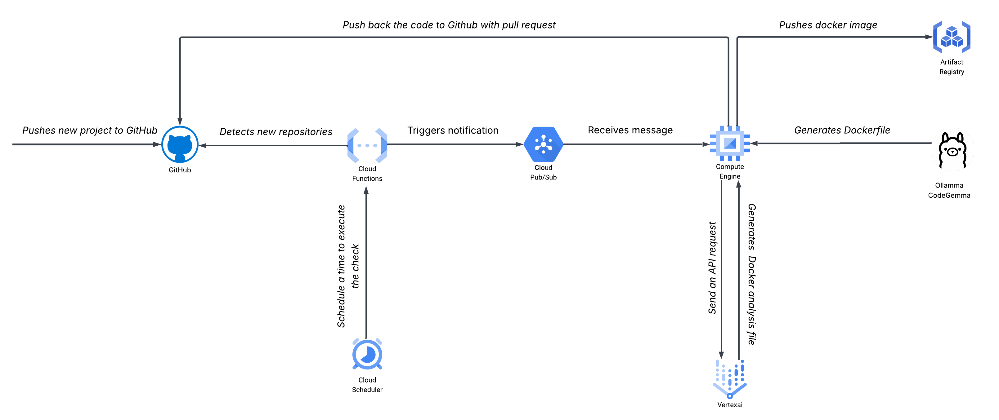

# Automated Dockerfile Generator

<p align="center">
  

</p>

<p align="center">
  Smart containerization for your programming projects. Built with Ollama.
</p>


## Table of Contents

- [Overview](#overview)
- [Purpose](#purpose)
- [Limitations](#limitations)
- [Supported Languages](#supported-languages)
- [Project Structure](#project-structure)
- [Local Deployment](#local-deployment)
- [Cloud Deployment](#cloud-deployment)

## Overview

[](https://github.com/yourusername/dockerfile-generator)
[](#supported-languages)
[](http://makeapullrequest.com)

This project automatically generates Dockerfiles for simple programming projects using AI. It analyzes project structure and creates appropriate Docker configurations without requiring manual Dockerfile creation.

## Purpose

- Automate containerization for learning projects and simple applications
- Reduce setup time for developers working with multiple programming languages
- Generate consistent Docker configurations based on project analysis
- Support continuous integration workflows with automated Docker builds

## Limitations

**Important**: This tool is designed for simple projects and has several limitations:

- **Simple Projects Only**: Designed for basic learning projects and single-language applications. Complex enterprise applications are not supported.
- **No Hybrid Language Support**: Projects mixing multiple programming languages will not work correctly, unless you have a clear main entry point (e.g., Python project with main.py).
- **No Code Analysis**: The generator does not analyze your actual code logic or dependencies. It only examines file structure and common configuration files.
- **Manual Customization Required**: If your project requires special configurations, custom build steps, or non-standard setups, you must manually modify the generated Dockerfile.
- **Limited Dependency Detection**: Only detects standard dependency files (requirements.txt, package.json, Makefile, etc.). Custom build systems are not supported.
- **No Runtime Configuration**: Does not predict special runtime requirements, environment variables, or custom startup procedures.

## Supported Languages

- Python (with/without requirements.txt)
- JavaScript/Node.js (with/without package.json)
- TypeScript (with tsconfig.json)
- Java (basic projects)
- C/C++ (with/without Makefile)
- Go (basic projects)
- Rust (basic projects)

## Project Structure

```
├── inputs/          # Place your projects here for processing
├── outputs/         # Generated Dockerfiles and moved projects
├── main.py          # Project analysis engine
├── Ollama-code.py   # Dockerfile generation script
└── README.md
```

## Local Deployment

### Prerequisites

- Python 3.8+
- Ollama installed locally

### Installation Steps

1. **Install Ollama:**
   ```bash
   # Linux/Mac
   curl -fsSL https://ollama.ai/install.sh | sh
   
   # Or download from https://ollama.ai
   ```

2. **Pull AI Model:**
   ```bash
   # Default model (recommended)
   ollama pull codegemma:7b
   
   # Alternative models (you can choose any):
   ollama pull codellama:7b
   ollama pull llama2:7b
   ```

3. **Install Python Dependencies:**
   ```bash
   pip install ollama
   ```

4. **Customize Model (Optional):**
   
   Edit Ollama-code.py and change the model name:
   ```python
   model = "codegemma:7b"  # Change to your preferred model
   ```

### How to Run

**Project Analysis Only:**
```bash
python main.py
```

**Output:**
- Analyzes projects in inputs/ directory
- Moves projects to outputs/ directory
- Displays project structure analysis
- No Dockerfile generation

**Full Dockerfile Generation:**
```bash
python Ollama-code.py
```

**Output:**
- Analyzes the first project in outputs/
- Generates Dockerfile using AI model
- Saves Dockerfile in the project directory
- Displays generated Dockerfile content

### Automated Processing (Cron Job)

```bash
# Edit crontab
crontab -e

# Add this line for processing every 5 minutes
*/5 * * * * cd /path/to/project && ./venv/bin/python Ollama-code.py >> /tmp/docker-gen.log 2>&1
```

## Cloud Deployment

### Pipeline Overview

The cloud deployment follows a fully automated DevOps pipeline:

**GitHub (new repo)** → **Cloud Function (detector)** → **Pub/Sub** → **VM pulls code** → **Ollama generates Dockerfile** → **Vertex AI analyzes** → **GCR stores image** → **Push back to GitHub (via GitHub API)**

### Architecture Components

1. **GitHub Repository**: Source code repository with webhook integration
2. **Cloud Function**: Webhook detector that triggers on new pushes
3. **Pub/Sub**: Message queue for decoupled pipeline orchestration
4. **Compute Engine VM**: Hosts Ollama AI model and processing logic
5. **Vertex AI**: Provides security analysis using Gemini 2.0 Flash
6. **Google Container Registry (GCR)**: Stores built Docker images
7. **GitHub API Integration**: Automatically pushes results back to repository

### Pipeline Workflow

1. **Code Push Detection**: Developer pushes new code to GitHub repository
2. **Webhook Trigger**: GitHub webhook triggers Cloud Function detector
3. **Message Queue**: Cloud Function publishes message to Pub/Sub topic
4. **Code Retrieval**: VM subscriber pulls latest code from GitHub
5. **AI Analysis**: Ollama CodeGemma analyzes project structure
6. **Dockerfile Generation**: AI creates optimized Dockerfile
7. **Security Analysis**: Vertex AI Gemini performs security scanning
8. **Image Building**: Docker builds and tags the container image
9. **Registry Storage**: Built image pushed to Google Container Registry
10. **GitHub Integration**: Results pushed back via GitHub API (PR or commit)

### Prerequisites

- Google Cloud Platform account with billing enabled
- GitHub repository with admin access
- GitHub Personal Access Token
- Required GCP APIs enabled

### Step-by-Step Setup(Coming soon)

If you'd like to move forward with this project, feel free to clone it, enhance it further, and share your improvements with me – I'd love to see how you expand on this automated containerization pipeline!
